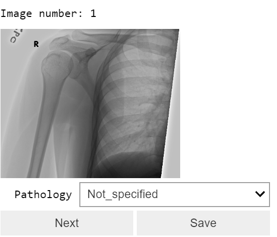

# Image Labler Widget

I wanted to label some of the images in a medical dataset and then run a model on those; so, I decided to write an IPython Widget that handles this easily. You can give it a pandas dataframe with one column being "path" and the widget will open the images sequentially and lets you label them. By clicking the Save button once in a while, all that you have labeled so far will be saved on your disk.

### This is how it looks like:
--

--